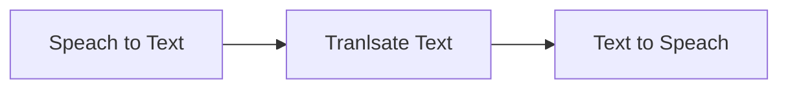

# Translator

This Sample convert spoken Audio from selected language, speach from other language, it uses the following AI servcies from Azure:

1.[Azure Speach](https://learn.microsoft.com/en-us/python/api/azure-cognitiveservices-speech/?view=azure-python)
2. [Azure Translator](https://learn.microsoft.com/en-us/azure/ai-services/translator/)

## Quick Start

1. Azure subscription -  [Create one for free](https://azure.microsoft.com/free/cognitive-services).
2. You can create  ALL in One service to  enable access to multiple Azure AI services using a single API key and endpoint.
or you can create separate Speach And Translator Services 

	-[Create All in one AI Service](https://ms.portal.azure.com/#create/Microsoft.CognitiveServicesAllInOne) 
	
	-[ Create Speach Service](https://portal.azure.com/#create/Microsoft.CognitiveServicesSpeechServices)
	
	-[Create Text Translation](https://ms.portal.azure.com/#create/Microsoft.CognitiveServicesTextTranslation)

4. add your API keys,region and endpoints to the Env Variables 
5. run the code 
6. select one of the languages for input and output [Language support - Speech service - Azure AI services | Microsoft Learn](https://learn.microsoft.com/en-us/azure/ai-services/speech-service/language-support?tabs=tts)
7. Enjoy!

## Example
>     select the input language:
>     
>     en-US
>     select the output language:
>     
>     ar-SA
>     start speaking we are listening....
>     Recognized: This is a test.
>     Detected languages of the input text: en with score: 1.0.
>     Text was translated to: 'ar' and the result is: 'هذا اختبار.'.
>     You are listening to following text [ هذا اختبار.]
